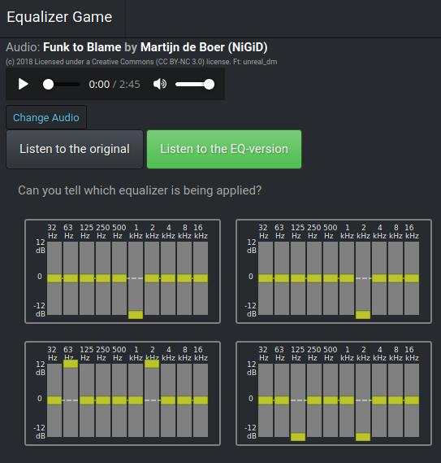

# Equalizer Game

Game for learning to recognize the differences in equalized audio,
by testing yourself with quizzes.

To play, go to: https://eliasdorneles.com/equalizer-game/

If it's your first time playing, start practicing with the audio _White noise_
to train yourself to recognize the frequency ranges at first.

## Technical details

Code: https://github.com/eliasdorneles/equalizer-game

The game is built in Javascript using the [Web Audio API](https://developer.mozilla.org/en-US/docs/Web/API/Web_Audio_API), tested on Firefox and Chromium, on Linux and Android.

License: BSD 3

## Screenshot

  
